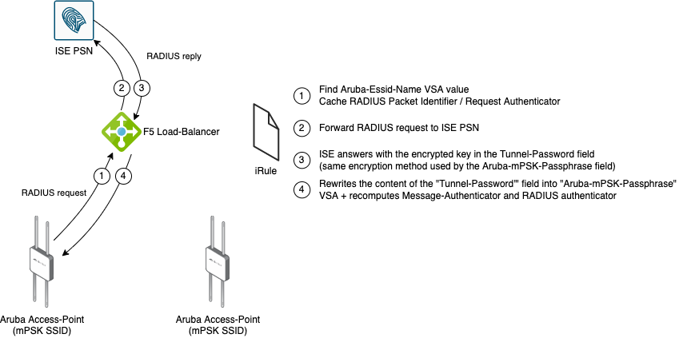

# Tunnel-Password to mPSK 

This iRule will make mPSK (Aruba Identity PSK) working with ISE, if your RADIUS traffic is load-balanced with an F5 VS. 

It makes use of the fact that the Aruba-mPSK-Passphrase VSA uses the same encryption type than the Tunnel-Password RADIUS field. 

This iRule will thus replicates the content of the Tunnel-Password RADIUS attribute into the Aruba-mPSK-Passphrase VSA, after removing the "tag" part. 
It will also rewrite the "Message-Authenticator" field (MD5-HMAC of the RADIUS payload) + "RADIUS-Authenticator" (MD5 hash of the RADIUS payload) after modifying the content. 
For this purpose, the RADIUS PSK needs to be on the iRule as it is used on the computation of those fields. 

Notice that the "Request-Authenticator" value of each request is cached (with the default 180 seconds timeout) on the session table (using the RADIUS Packet-Identifier value as a key), as this value is 
also reused to calculate the "Message-Authenticator" and "RADIUS-Authenticator" fields of the reply. 

